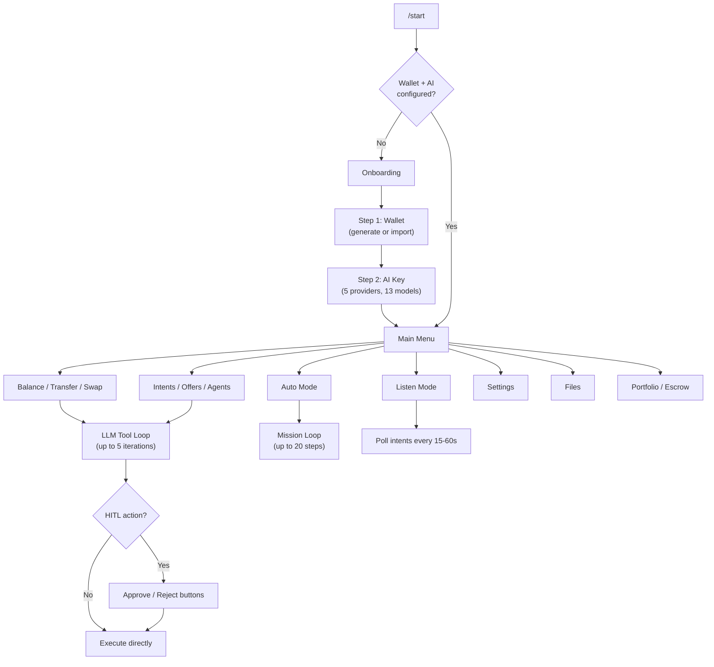
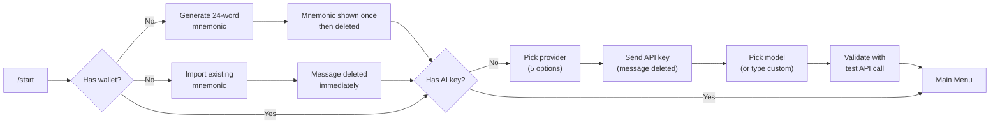

# TON Agent Bot

A multi-user Telegram bot that gives each user their own AI-powered TON blockchain agent. Users bring their own wallet and LLM API key. The bot operator runs the infrastructure, pays nothing for AI or gas.

Built on [TON Agent Kit](https://github.com/Andy00L/ton-agent-kit) -- 15 npm packages, 11 plugins, 75+ actions.

## Quick Start

```bash
git clone https://github.com/Andy00L/ton-agent-bot.git
cd ton-agent-bot
bun install
echo "TELEGRAM_BOT_TOKEN=your_token" > .env
bun run start
```

On first run:
1. The CLI asks you to choose a network mode: **local**, **public**, or **tunnel**
2. Open Telegram, find your bot, send `/start`
3. The bot walks you through wallet setup and AI key setup

No mnemonic or API key needed in `.env`. Each user configures their own inside Telegram.

## How It Works



## Features

### Multi-User Isolation

Each Telegram user gets their own:
- Wallet (encrypted in SQLite, AES-256-GCM with per-user derived keys)
- LLM API key (same encryption)
- Chat history
- TonAgentKit instance with 10 plugins
- File storage (50 MB quota)
- x402 paid endpoints routed to their wallet

No shared state between users.

### Onboarding



Wallet: generate new (24-word BIP39) or import existing mnemonic. V5R1 wallet version.

AI: 5 providers (OpenAI, OpenRouter, Groq, Together, Mistral), 13 preset models. Custom model names accepted and validated with a real API call before saving.

Skip button available -- read-only mode works without wallet or AI key.

### 3 Operating Modes

**Normal** -- Type naturally, the LLM picks the right actions. Up to 5 tool iterations per message.

**Listen** -- Polls the intent marketplace every 15-60s. Shows new intents, tracks offers on your own intents. Filter by service name. Random shuffle view.

**Auto** -- Give a mission in plain text. The LLM runs autonomously for up to 5/10/15/20 steps (configurable). Progress updates in real-time. Stops on completion or error.

### HITL (Human-in-the-Loop)

25 actions require approval when Confirm mode is on. 15 of those always require approval regardless of amount (contract deployments, dispute votes, offer sends).

The remaining 10 auto-approve below the threshold (default: 0.05 TON, configurable to 0.05/0.1/0.5/1.0 TON).

Approval buttons: Approve / Reject, with 2-minute timeout (auto-reject).

Formatted approval messages show action-specific details:
- Transfers: amount + recipient
- Escrow: amount + beneficiary
- Swaps: token pair + amount
- Intents: service + budget
- Offers: intent ID + price + delivery time

### File Storage

Action results that return binary data (images, audio, PDFs) are stored automatically.

- 48-hour TTL, auto-cleanup every hour
- 10 MB per file, 50 MB per user
- View/Play/Download/Delete buttons in Telegram
- JSON results over 4 KB also saved as files
- Paginated file browser with storage usage display

### x402 Paid Endpoints

Each user gets paid HTTP endpoints at `/u/{uid}/api/{service}`. Buyers pay TON directly to the user's wallet via the x402 payment protocol.

Built-in services:
| Service | Price | Action |
|---|---|---|
| `price` | 0.005 TON | `get_price` (TON) |
| `analytics` | 0.01 TON | `get_portfolio_metrics` (7d) |
| `balance` | 0.002 TON | `get_balance` |

The LLM can also open custom endpoints via `open_x402_endpoint` and close them with `close_x402_endpoint`.

### Security

- **AES-256-GCM** encryption for mnemonics and API keys, per-user derived keys from a server secret
- **deleteMessage** immediately after mnemonic/API key input
- **30-second auto-delete** for mnemonic export display
- **SQLite prepared statements** throughout (no string concatenation)
- **Per-user locks** prevent concurrent LLM calls that would corrupt chat history
- **Server secret** auto-generated on first run, stored in `.env` as `WALLET_ENCRYPTION_KEY`

## Architecture

```
telegram-bot.ts          <- entry point (153 lines)

src/
 |- config.ts            <- constants, HITL sets, UserState, getState
 |- context.ts           <- BotContext interface
 |- helpers.ts           <- escapeHtml, shortAddr, formatTon, safeReply
 |- keyboards.ts         <- 7 keyboard factories
 |
 |- services/
 |   |- agent.ts         <- getUserAgent, getUserOpenAI, makeSystemPrompt
 |   |- llm.ts           <- executeLLMLoop, handleNormalMessage, handleAutoMode
 |   |- listen.ts        <- startListening, stopListening, pollIntents, pollMyOffers
 |   |- tracking.ts      <- startOfferTracking (15s polling)
 |   |- approval.ts      <- requestApproval (formatted HITL buttons)
 |   |- files.ts         <- handleActionResult (binary/JSON routing)
 |   '- x402.ts          <- Express server, tonPaywall middleware
 |
 '- handlers/
     |- onboarding.ts    <- /start + wallet/AI setup (9 handlers)
     |- main-menu.ts     <- balance, intents, offers, agents, escrow (24 handlers)
     |- settings.ts      <- toggles, wallet mgmt, AI mgmt (16 handlers)
     |- listen-mode.ts   <- listen callbacks (7 handlers)
     |- auto-mode.ts     <- auto callbacks (2 handlers)
     |- files.ts         <- file browser callbacks (7 handlers)
     |- message.ts       <- text handler, input routing (1 handler)
     '- hitl.ts          <- approve/reject (2 handlers)

20 files, 2308 lines total
68 callback handlers across 8 handler files
```

## SDK Packages Used

| Package | Version | Purpose |
|---|---|---|
| `@ton-agent-kit/core` | ^1.2.2 | Base SDK, wallet, plugin system |
| `@ton-agent-kit/plugin-token` | ^1.1.1 | TON/Jetton transfers |
| `@ton-agent-kit/plugin-defi` | ^1.2.2 | Swaps (DeDust, STONfi), prices, yield |
| `@ton-agent-kit/plugin-dns` | ^1.0.3 | Domain resolution, lookup |
| `@ton-agent-kit/plugin-nft` | ^1.0.3 | NFT info, collections |
| `@ton-agent-kit/plugin-staking` | ^1.0.3 | Staking pools, stake/unstake |
| `@ton-agent-kit/plugin-escrow` | ^1.5.2 | Escrow create/deposit/release/dispute |
| `@ton-agent-kit/plugin-identity` | ^1.6.4 | Agent registration, reputation |
| `@ton-agent-kit/plugin-analytics` | ^1.1.1 | Portfolio metrics, equity curve |
| `@ton-agent-kit/plugin-payments` | ^1.0.4 | Payment processing |
| `@ton-agent-kit/plugin-agent-comm` | ^1.3.3 | Intents, offers, discovery |
| `@ton-agent-kit/plugin-endpoints` | ^1.0.0 | x402 endpoint management |
| `@ton-agent-kit/wallet-store` | ^1.0.0 | Encrypted SQLite storage, LLM providers |
| `@ton-agent-kit/x402-middleware` | ^1.1.1 | Express middleware for TON payments |
| `@ton-agent-kit/network-mode` | ^1.0.0 | CLI network mode selector |

Full SDK: [github.com/Andy00L/ton-agent-kit](https://github.com/Andy00L/ton-agent-kit)

## LLM Providers

| Provider | Base URL | Models |
|---|---|---|
| OpenAI | `api.openai.com` | gpt-4o, gpt-4o-mini, gpt-4.1-nano |
| OpenRouter | `openrouter.ai/api/v1` | openai/gpt-4o, anthropic/claude-sonnet-4, meta-llama/llama-3.3-70b-instruct |
| Groq | `api.groq.com/openai/v1` | llama-3.3-70b-versatile, llama-3.1-8b-instant, mixtral-8x7b-32768 |
| Together | `api.together.xyz/v1` | meta-llama/Llama-3.3-70B-Instruct-Turbo, Qwen/Qwen2.5-72B-Instruct-Turbo |
| Mistral | `api.mistral.ai/v1` | mistral-large-latest, mistral-small-latest |

5 providers, 13 preset models. Users can also type any custom model name -- the bot validates it with a test API call.

## Environment Variables

```
TELEGRAM_BOT_TOKEN=     # Required. From @BotFather
TON_NETWORK=testnet     # Optional. Default: testnet
X402_PORT=4000          # Optional. Default: 4000
TON_MNEMONIC=           # Optional. Dev-only fallback wallet
```

That's it. No `OPENAI_API_KEY`, no user mnemonics. Users configure everything inside Telegram.

`WALLET_ENCRYPTION_KEY` is auto-generated on first run and appended to `.env`.

## Callback Handlers

68 handlers across 8 files:

| File | Handlers | Scope |
|---|---|---|
| `onboarding.ts` | 9 | /start, wallet generate/import, AI provider/model selection, skip |
| `main-menu.ts` | 24 | Balance, transfer, swap, intents CRUD, browse, offers, agents, escrow, portfolio, help |
| `settings.ts` | 16 | Toggles (confirm/auto/listen), cycles (HITL/steps/poll), wallet export/change/disconnect, AI change/remove |
| `listen-mode.ts` | 7 | Start/stop listen, show new, random, filter, clear filter, poll now |
| `auto-mode.ts` | 2 | Start/stop auto mode |
| `files.ts` | 7 | List, view, play, download, delete, delete all |
| `message.ts` | 1 | Text router (mnemonic, API key, filter, transfer, swap, intent, offer price, auto mission, normal chat) |
| `hitl.ts` | 2 | Approve, reject |

## Screens

- **Main menu** -- Wallet address, balance, network, 14 action buttons
- **Intents** -- User's active intents, browse marketplace, paginated, offer form
- **Agents** -- Paginated agent list with reputation scores
- **Escrow** -- Active endpoints, open disputes
- **Settings** -- 6 toggles/cycles, wallet management (export/change/disconnect), AI management (change/remove)
- **Listen** -- Polling status, filter, show new, random 5
- **Auto** -- Mission input, real-time step progress
- **Files** -- Paginated file list with storage usage, per-file actions
- **Onboarding** -- Step 1 wallet, step 2 AI, skip option
- **Balance** -- TON amount, USD estimate, Tonviewer link
- **Portfolio** -- 7-day PnL, ROI, win rate, drawdown

## Deploy

```bash
# VPS
git clone https://github.com/Andy00L/ton-agent-bot.git
cd ton-agent-bot
bun install
echo "TELEGRAM_BOT_TOKEN=your_token" > .env
echo "TON_NETWORK=testnet" >> .env
bun run start
# Choose [2] Public -- enter your server's IP/domain
```

For 24/7 operation:

```bash
# tmux
tmux new -s tonbot
bun run start
# Ctrl+B, D to detach

# pm2
pm2 start bun -- run start
pm2 save
```

## Known Limitations

- `userAgents` Map grows indefinitely in memory (no eviction). Fine for hackathon scale.
- No TON Connect -- wallet import via mnemonic only.
- Listen/tracking timers use `setInterval` -- no persistence across restarts. Active listen sessions are lost on restart.
- Chat history capped at 40 messages per chat (sliding window). Long conversations lose early context.
- Approval timeout is 2 minutes, not configurable.
- x402 built-in services are hardcoded (price, analytics, balance). Custom endpoints require the LLM.
- No rate limiting on the x402 Express server.

## Related

- **SDK**: [github.com/Andy00L/ton-agent-kit](https://github.com/Andy00L/ton-agent-kit) -- 15 packages, 75+ actions
- **npm**: [npmjs.com/org/ton-agent-kit](https://www.npmjs.com/org/ton-agent-kit)

## License

MIT
